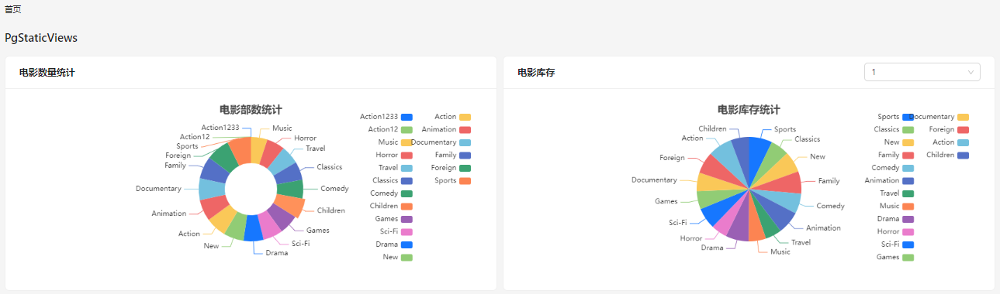

# FilmRent 电影租赁示例应用简介

FilmRent 示例使用 SnapDevelop 2026 开发，展示如何通过其可视化设计器，结合 [pagila (postgresql)](https://github.com/devrimgunduz/pagila) 数据库，快速实现电影租赁业务的数据维护和统计分析功能。

## 应用构建步骤

以下将介绍使用 SnapDevelop 2026  构建本示例应用的关键步骤，让您直观感受其快速开发优势。

1. 从 http://www.aipuyang.com 下载安装 SnapDevelop 2026. 

2. 配置数据库。下载 [pagila (postgresql)](https://github.com/devrimgunduz/pagila) 数据库，且根据其说明完成相关配置。

3. 启动 SnapDevelop 2026，创建类型为"浏览器端 Web 和 API“的项目，命名为 FilmRent.sln。

4. 选择通过数据库导入的方式创建一系列实体。您可以打开示例中的 Pagila.sde文件，了解所创建的实体，实体间的关系，和每个实体的属性。

   

5. 在 Pagila.sde 设计面板中选择快速创建逻辑，基于已有的实体快速生成逻辑。

   

6. 打开每个逻辑文件，借助逻辑设计器，可以快速根据实际业务规则调整、优化逻辑，如电影演员维护方法 （BindActors）中的逻辑设计：

   

7. 借助设计的逻辑快速生成前端页面，并根据需求进行调整。

   

   如电影演员维护页面设计：

   

8. 点击 FilmRent 项目右键，选择生成项目。请注意在生成设置中，需要将数据库连接信息更新为当前环境中的服务器信息。

   

   SnapDevelop 将自动基于 FilmRent 中的实体、逻辑和视图设计，生成 SourceCode 项目，其中包含标准的 Server 项目（后端项目）和 Web 项目 （前端项目）。

   

    

## 应用运行效果

- 首页 - 数据统计

   

- 会员 - 客户列表

  

- 电影 - 电影管理

  

- 库存 - 库存列表 

  

- 配置 - 电影管理

  

- 地址 - 地址管理

  

## 更多信息

如需了解更多关于 SnapDevelop 的使用信息，欢迎访问：https://docs.aipuyang.com.