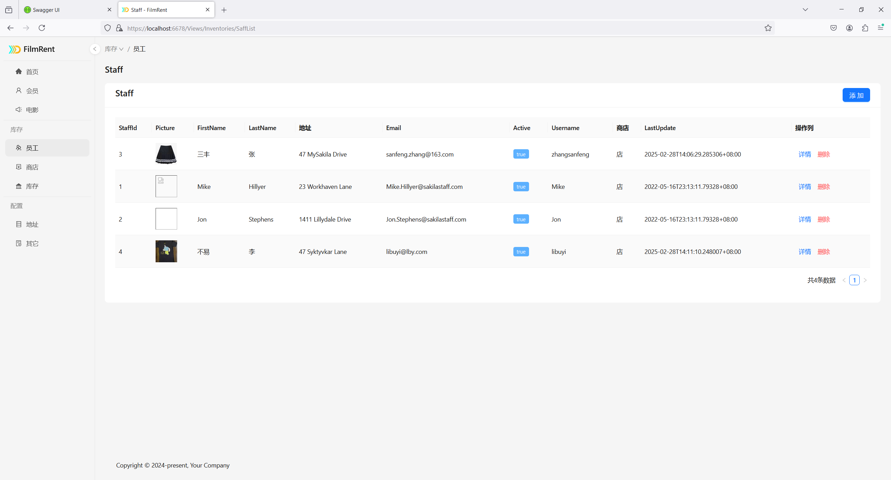
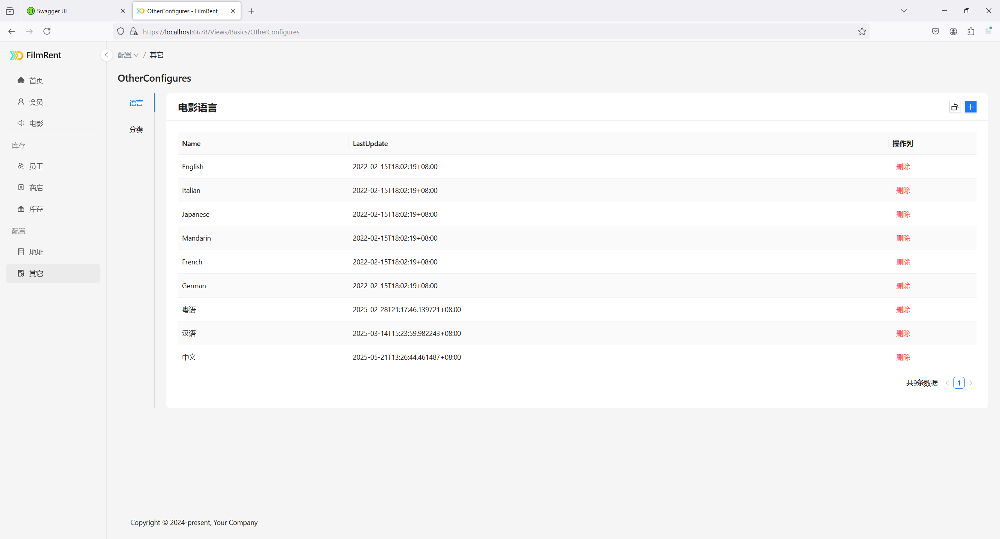

# 创建 FilmRent 电影租赁系统

## 应用下载地址

本教程通过一个演示应用程序，展示如何借助 SnapDevelop 的可视化设计器，实现电影租赁业务的数据维护和统计分析功能（运行于浏览器端）。

请首先下载演示应用示例：[https://github.com/Aipuyang/LowCode-RentFilm-CNExample](https://github.com/Aipuyang/LowCode-RentFilm-CNExample)，然后再阅读教程。

## 设计思路

### 项目类型

此应用示例的设计项目类型是 **浏览器端 Web 和 API**，以便同时生成前端 Web 应用程序及后端 Web API 服务。

### 实体（表）

应用示例包含一个实体文件，该实体文件包含的表如下：

- Rental
- FilmCategory
- FilmActor
- Inventory
- Customer
- Staff
- Category
- Film
- Actor
- Address
- Store
- Language
- City
- Country
- Payment

          

### 逻辑

应用示例包含了以下逻辑设计文件：

- Actor.sdlg
- Address.sdlg
- Category.sdlg
- City.sdlg
- Country.sdlg
- Cusomer.sdlg
- Film.sdlg
- Inventory.sdlg
- Language.sdlg
- Payment.sdlg
- PigilaStatics.sdlg
- Rental.sdlg
- Staff.sdlg
- Store.sdlg

请打开各个逻辑文件，查看其中定义的过滤器和方法。并通过右下角 **被引用** 区中的文件链接打开引用文件直接查看如何调用当前方法。

### 模型

对于每个实体表会自动生成一个同名的模型，例如：Actor、Address、Category 等。

系统还提供了部分内置模型，例如：LoginModel、LoginResult、OperationResult、PageParameter、PageResult、RegisterModel。

此应用示例还包含以下自定义模型：

- CategoryStaticModel
- CusFilmModel
- FilmActorBind
- FilmCategoryPayedModel
- RentalStatics
- StoreDetail

请点击右下角 **被引用** 区中的文件链接打开引用文件直接查看如何调用当前模型。


### 视图

#### 布局（Layout）

布局页面设计了多个子菜单，分别对应如下页面：

1.  首页 -- 关联 PgStaticViews.sdv 视图，主要用于统计数据展示。
2.  会员 -- 关联 CustomerManager.sdv 视图，主要用于展示和操作会员及租赁记录。
3.  电影 -- 关联 FilmManager.sdv 视图，主要用于展示和操作电影租赁情况。
4.  库存
    1.  员工 -- 关联 SaffList.sdv 视图，主要用于展示和操作员工。
    2.  商店 -- 关联 StoreList.sdv 视图，主要用于展示和操作商店。
    3.  库存 -- 关联 InventList.sdv 视图，主要用于展示和操作库存。

5.  配置
    1.  地址 -- 关联 AddressManager.sdv 视图，主要用于展示和操作商店地址。
    2.  其他 -- 关联 OtherConfigures.sdv 视图，主要用于展示和操作电影语言和分类。


运行效果如下：


#### 首页（PgStaticViews）

首页使用图表组件展示查询模型接口数据。

**电影数量统计**

电影部数统计饼图 -- 关联PigilaStatics逻辑的GetCategoryFilmStatics方法（GetCategoryFilmStatics方法的数据源为Film、FilmCategory、Category）

**电影库存**

电影地址下拉选择框 -- 关联Address逻辑的GetList方法（GetList方法的数据源为Address）。

电影库存统计折线图 -- 关联PigilaStatics逻辑的GetStoreStatics方法，将storeid参数与电影地址下拉选择框中的数据进行关联绑定，通过GetStoreStatics方法将参数值传递给StoreFilter过滤器，作为过滤参数，返回相应过滤数据（GetStoreStatics方法的数据源为Inventory、FilmCategory、Category，过滤器为StoreFilter）。

**电影租赁额**

电影租赁频营业额柱状图 -- 关联PigilaStatics逻辑的GetCategoryRentalStatics方法（GetCategoryRentalStatics方法的数据源为Category、FilmCategory、Inventory、Rental、Payment）。

**电影租赁频次**

电影类别下拉选择框 -- 关联Category逻辑的GetList方法（GetList方法的数据源为Category）。

电影收视率统计饼图 -- 关联PigilaStatics逻辑的GetFilmRentalStatics方法，将categoryid参数与电影类别下拉选择框中的数据进行关联绑定，通过GetFilmRentalStatics方法将参数值传递给CategoryFilter过滤器，作为过滤参数，返回相应过滤数据（GetFilmRentalStatics方法的数据源为Film、FilmCategory、Inventory、Rental，过滤器为CategoryFilter）。

首页运行效果如下：


#### 会员（CustomerManager）

会员页面提供以下操作按钮：

- 统计 -- 打开一个对话框，显示客户租赁统计数据（数据源为 PigilaStatics 逻辑文件的 GetCustomerRentalStatics 方法）。
- 详情 -- 以对话框形式打开客户详情页面（CustomerDetail.sdv）。
- 支付 -- 以对话框形式打开支付页面（PayCreate.sdv）。
- 归还 -- 调用 Rental 逻辑的 ReturnFilm 方法。


#### 电影（FilmManager）

电影页面提供以下操作按钮：

- 编辑：以抽屉形式打开电影编辑视图（FilmEdit.sdv）。
- 演员列表：在当前窗口打开演员列表（ActorList.sdv）。
- 入库：打开一个对话框，显示仓库列表（数据源为 Store 逻辑文件的 GetList 方法）。


#### 员工（SaffList）

员工页面提供以下操作按钮：

- 添加 -- 以对话框形式打开新增员工视图（StaffCreate.sdv）。
- 详情 -- 在当前窗口打开员工详情页面（StaffDetail.sdv）。
- 删除 -- 在气泡确认框的确定按钮的事件中调用Staff逻辑的Delete方法。



#### 商店（StoreList）

商店页面提供以下操作按钮：

- 新增商店 -- 以对话框形式打开新增商店视图（StoreCreate.sdv）。


#### 库存（InventList）

库存页面提供以下操作按钮：

- 租借 -- 以对话框形式打开租借视图（RentCreate.sdv）。
- 删除 -- 在气泡确认框的确定按钮的事件中调用Inventory逻辑的Delete方法。


#### 地址（AddressManager）

地址页面提供以下操作按钮：

- 新建城市 -- 以对话框形式打开新建城市视图（CityCreate.sdv）。
- 更新城市 -- 以对话框形式打开更新城市视图（CityUpdate.sdv）。
- 新增地址 -- 以对话框形式打开新增地址视图（AddressAdd.sdv）。
- 编辑地址 -- 以抽屉形式打开编辑地址视图（AddressEdit.sdv）。


#### 其他（OtherConfigures）

其他页面提供以下操作按钮：

- 创建语言 -- 以对话框形式打开创建语言视图（LanguageCreate.sdv）。
- 创建分类 -- 以对话框形式打开创建分类视图（CategoryCreate.sdv）。



## 开发流程

以下是开发演示应用程序的详细分步指南。

### 创建设计器项目

在 SnapDevelop 中，选择 **文件** > **新建** > **新建项目** > **浏览器端 Web 和 API**。

如果您已经下载了演示应用程序，可以直接在 SnapDevelop 中打开它。


### 创建实体和逻辑

右键单击项目并选择 **添加** > **新建项** > **实体设计（从零开始）** 添加一个空白实体文件，假设命名为 Pagila.sde，然后在实体文件中添加以下表：

- Rental 
- FilmCategory 
- FilmActor 
- Inventory 
- Customer 
- Staff 
- Category 
- Film 
- Actor 
- Address 
- Store 
- Language 
- City 
- Country 
- Payment 

如果您已下载演示应用程序，则可以打开 **Pagila.sde** 文件来查看设置。

下面主要以少数表和逻辑为例进行介绍。其他的表和逻辑的设计雷同。

#### Rental 表

下面介绍设计 **Rental ** 表的关键步骤：

步骤 1：将 **Id** 字段设置为 **主键**。

步骤 2：将 **ReturnDate** 字段设置为 **可空**。

步骤 3：创建以下外键映射关系：

- StaffId 引用 Staff 表的 StaffId 字段。
- InventoryId 引用 Inventory 表的 InventoryId 字段。
- CustomerId 引用 Customer 表的 CustomerId 字段。


#### Rental 逻辑

首先添加一个逻辑设计文件（右键单击项目并选择 **添加** > **新建项** > **逻辑设计（API）** ），假设命名为 Rental.sdlg。这个文件用来设计跟 Rental 表相关的逻辑，比如过滤器、增删改查方法等。

##### 过滤器

在 Rental.sdlg 逻辑设计文件中添加一个名为 **CustomerFilter** 的过滤器。只显示当前客户的租赁记录。

这个过滤器将在 GetPage 方法中用到。


##### 方法

在 Rental.sdlg 逻辑设计文件中添加增删改查方法：

1. 选择 **Rental** 表为数据源，选中所有方法类型，点击 **添加**。

2. 用同样方法，选择 **更新**，点击 **添加**。将方法名改为 ReturnFilm。

3. 选中 GetPage 方法，从左下角的组件库中拖拽相应组件到中间的流程设计区中，实现以下逻辑：

   1. 查询支付列表 -- 从组件库拖入查询组件，数据源为Payment。
   2. 查询租赁列表 -- 从组件库拖入查询组件，数据源为Rental，关联查询选中以下表：Staff、Inventory、Store、Address、Film，过滤器为CustomerFilter。
   3. 将查询结果存入一个变量以供后续操作 -- 从组件库拖入变量定义组件，变量名为result，变量值为Rental模型，表示与模型绑定传递和接收数据。
   4. 对查询结果进行遍历判断付款状态 -- 从组件库拖入遍历组件，数据源为result变量，从组件库拖入条件分支，通过以下表达式对结果中的每项判断是否已付款，并根据判断结果进行数据适配。

   ```
   Contains(Select(查询支付列表.QueryModel.RentalId), 遍历.当前项.RentalId)
   ```


#### Inventory 表

下面介绍设计 **Inventory** 表的关键步骤：

步骤 1：将 **Id** 字段设置为 **主键**，默认值为SQL：

```
nextval('inventory_inventory_id_seq'::regclass)
```

步骤 2：创建以下外键映射关系：

- StoreId 引用 Store 表的 StoreId 字段。
- FilmId 引用 Film 表的 FilmId 字段。


#### Inventory 逻辑

首先添加一个逻辑设计文件（右键单击项目并选择 **添加** > **新建项** > **逻辑设计（API）** ），假设命名为 Inventory.sdlg。这个文件用来设计跟 Inventory 表相关的逻辑，比如过滤器、增删改查方法等。

##### 过滤器

在 Inventory.sdlg 逻辑设计文件中添加一个名为 **FreeFilter** 的过滤器。用于筛选出所有“尚未归还”或“尚未开始”的租赁记录。

这个过滤器将在 GetPage 方法中用到。


##### 方法

在 Inventory.sdlg 逻辑设计文件中添加增删改查方法：

1. 选择 **Inventory** 表为数据源，选中所有方法类型，点击 **添加**。

2. 用同样方法，选择 **新增**，点击 **添加**。将方法名改为 AddInvert。在右边 **方法** 选项卡中，添加参数 filmid 和 storeid。

3. 选中 GetPage 方法，从左下角的组件库中拖拽相应组件到中间的流程设计区中，实现以下逻辑：

   1. 查询租赁列表 -- 从组件库拖入查询组件，数据源为Rental，过滤器为FreeFilter。
   
   2. 查询库存列表 -- 从组件库拖入查询组件，数据源为Inventory，关联查询选中以下表：Store、Address、Film。
   
   3. 将查询到的库存列表存入一个变量以供后续操作 -- 从组件库拖入变量定义组件，变量名为inventories，变量值为Inventory模型，表示与模型绑定传递和接收数据。
   
   4. 对查询结果进行遍历判断状态 -- 从组件库拖入遍历组件，数据源为inventories变量，从组件库拖入条件分支，通过以下表达式对结果中的每项判断是否存在已出借列表。
   
      ```
      IsNull(查询租赁列表.Rental)
      ```
   
      如为true则跳出循环，如为false，则继续判断是否已出借，并根据判断结果进行数据适配。
   
      ```
      Contains(Select(查询租赁列表.Rental.InventoryId), 遍历.当前项.InventoryId)
      ```
   
   

#### Actor 表

下面是 **Actor** 表的设计：


#### Actor 逻辑

首先添加一个逻辑设计文件（右键单击项目并选择 **添加** > **新建项** > **逻辑设计（API）** ），假设命名为 Actor.sdlg。这个文件用来设计跟 Actor 表相关的逻辑，比如过滤器、增删改查方法等。

##### 过滤器

在 Actor.sdlg 逻辑设计文件中添加以下过滤器。

用于找出所有参与当前这部电影的演员记录。


用于查找属于某个分类并且演员中包含特定演员的电影。


用于查找某位演员是否参与了某部电影。


用于筛选出演员ID属于id集合中的演员。


##### 方法

在 Actor.sdlg 逻辑设计文件中添加增删改查方法：

1. 选择 **Actor** 表为数据源，选中所有方法类型，点击 **添加**。

2. 用同样方法，选择 **新增**，点击 **添加**。将方法名改为 BindActors。在流程设计区中实现以下逻辑：

   1. 选中 **开始** 组件，添加参数model，类型为FilmActorBind模型。

   2. 从组件库拖入变量定义组件，变量名为isSucceed，类型为Boolean。

   3. 查询演员列表（从组件库拖入查询组件，数据源为FilmActor，过滤器为FilmFilter，过滤参数为FilmId，值为：开始.model.FilmId）。

   4. 遍历现有演员列表（从组件库拖入遍历组件，数据源为：开始.model.ActorIds，从组件库拖入条件分支，通过以下表达式判断演员是否已属于当前电影演员，如为false，则新增演员，进行数据适配）

      ```
      Contains(Select(查询演员列表.FilmActor.ActorId), 遍历现有演员列表.当前项)
      ```

   
   
   
3. 添加UnBindActor方法，添加参数actorid和filmid，数据源为FilmActor。
4. 添加GetCategoryFilms方法，数据源为Film、FilmActor、FilmCategory、Language，过滤器为ActorFilter（过滤器参数有Category和Actors）。添加一个变量定义组件，名称为result，类型为CusFilmModel模型，该变量代表查询结果，在FilmManager视图中使用。
5. 添加GetFilmActors方法，数据源为FilmActor、Actor，过滤器为FilmFilter。

#### 其他

以上为需要特别说明的表和逻辑。其他表和逻辑的设计请参考演示应用程序中的相关实体和逻辑文件。

### 创建视图

下面主要以 Films 相关视图为例进行介绍。其他的视图操作雷同。

#### Films 相关视图

##### ActorCreate 视图

ActorCreate 视图将显示一个可录入演员信息的表单，然后通过Actor逻辑的Add方法提交数据。

右键单击项目并选择 **添加** > **新建项** > **视图设计（基于模板）**（或 **视图设计（从零开始）**）。名称设为 **ActorCreate**。点击 **下一步**。

选择 **表单页面**。选择Actor逻辑的Add方法为表单提交API，点击 **创建**。


你可以根据需要调整 UI，以及新增删除组件。


##### ActorList 视图

ActorList 视图将通过Actor逻辑的GetFilmActor方法获取当前电影的演员列表。并允许进行绑定和解绑演员。

绑定演员 -- 以对话框形式打开ActorSelect视图，在确认按钮点击事件中调用Actor逻辑的BindActor方法。

解绑演员 -- 在气泡确认框中调用Actor逻辑的UnBindActor方法。


##### ActorSelect 视图

ActorSelect 视图通过Actor逻辑的GetPage方法获取所有演员列表。并允许进行添加和删除演员。

添加演员 -- 以对话框形式打开ActorCreate视图。

删除演员-- 在气泡确认框中调用Actor逻辑的Delete方法。


##### FilmEdit 视图

FilmEdit 视图通过Film逻辑的Get方法获取当前电影的详情，然后通过Film逻辑的Update方法提交修改的数据。


##### FilmManager 视图

FilmManager 视图通过Category逻辑的GetList方法获取电影类别，通过Actor逻辑的GetList方法获取演员列表，通过Actor逻辑的GetCategoryFilms方法获取电影列表。允许通过类别和演员来过滤电影列表（将过滤器ActorFilter的Category和Actors参数分别与树形控件以及多选框组绑定）。同时，它还提供了以下操作按钮：

- 编辑 -- 以抽屉形式打开FilmEdit视图。
- 演员列表 -- 在当前窗口打开ActorList视图。
- 入库 -- 在对话框的下拉选择框中绑定数据源为Store逻辑的GetList方法，在入库按钮的点击事件中调用Inventory逻辑的AddInvent方法。


#### 其他视图

其他的视图设计雷同。请参考演示应用程序中的相关视图文件。

### 生成并运行项目

从 IDE 工具栏中选择 **生成项目**，或右键单击项目节点，然后选择 **生成项目** > **Profile**；在 Profile 窗口的右上角单击 **生成项目**。

项目生成成功后，运行 **[project].WebApi** 项目即可启动 Web API。


启动 Web API 后，可以运行  **[project]** 项目启动 Web 应用程序。


